<div align="center">

[](LICENSE)


[](https://github.com/SethGammon/sinan/stargazers)
[](https://sethgammon.github.io/sinan/)

**Sinan is an open-source orchestration layer for Claude Code and OpenAI Codex.**

It gives your coding agent durable project memory, `/do` intent routing, safety hooks, cost telemetry, and parallel agents in isolated git worktrees.

Sinan is for developers who want AI coding agents to work across real projects, not just isolated chats.

**Fast path:** open your project in Claude Code or Codex, paste the install prompt below, then run:

```text
/do setup --express
```

[Install](#quick-install) | [Demo Workflow](DEMO.md) | [Why It Exists](#why-sinan-exists) | [Roadmap](#roadmap)

</div>

---

## What Is Sinan?

Sinan turns one-off coding-agent chats into repeatable engineering workflows.

Claude Code and OpenAI Codex are strong at local reasoning and code edits, but each session still needs project context, safe operating rules, task routing, and a way to continue work after context resets. Sinan provides that harness layer:

- **Project memory:** project state, decisions, discoveries, telemetry, and handoffs live in repo-local `.planning/` files.
- **Routing:** `/do` classifies plain-English requests and dispatches to the right skill or orchestrator.
- **Hooks:** lifecycle checks enforce file protection, quality gates, telemetry, and safety policies.
- **Parallelism:** Fleet mode splits large work across agents running in isolated git worktrees.

If `CLAUDE.md` and `AGENTS.md` tell the runtime what your project is, Sinan tells the runtime how to operate on it.

## Quick Install

**Prerequisites:** Claude Code or OpenAI Codex, Node.js 18+, and a git repository you want Sinan to manage.

### Recommended: Paste This Into Your Agent

The setup sequence is:

1. Open the repository you want Sinan to manage in Claude Code or OpenAI Codex.
2. Paste the install prompt below.
3. Let the installer run and follow any plugin enable step it prints.
4. Start a fresh session if the runtime asks for one.
5. Run `/do setup --express`.

Paste this:

```text
Install Sinan in this repository.

Use https://github.com/SethGammon/sinan as the source. If a local clone
already exists, reuse it or update it. Detect whether this session is running
in OpenAI Codex or Claude Code. From this project's root, run the matching
Sinan installer and follow any printed plugin enable step.

After Sinan is enabled in a fresh thread, run:

/do setup --express

Use the current repository as the target project. Do not require placeholder
path edits.
```

That prompt is intentionally path-free. The agent should clone or update Sinan, choose the correct runtime installer, and use the repository it is already running in as the target.

### Manual Fallback

Only use this path if you want to run the installer yourself.

First, clone Sinan once:

```bash
git clone https://github.com/SethGammon/sinan.git ~/sinan
```

Then run exactly one installer from the target project root.

For OpenAI Codex:

```bash
node ~/sinan/scripts/install.js --runtime codex --add-marketplace
```

For Claude Code:

```bash
node ~/sinan/scripts/install.js --runtime claude --install --scope local
```

Then start a fresh Codex or Claude Code session in the same project and run:

```text
/do setup --express
```

That is the important command. Express setup auto-detects the project, installs or refreshes hooks, scaffolds Sinan state, and gets you to a working `/do` command without a tour.

For a copyable first-run walkthrough, see [DEMO.md](DEMO.md). For runtime-specific details, dry runs, and troubleshooting, see [INSTALL.md](INSTALL.md) and [QUICKSTART.md](QUICKSTART.md).

## Demo Workflow

After install, copy this into Claude Code or Codex from your project root:

```text
/do setup --express
/do next
/do review README.md
/do identify the project's safest verification command and run it
/do generate tests for the changed files
/cost
```

Then try a larger task:

```text
/do audit the auth module and fix the highest-risk issue
/do continue
```

For a live visual of the router tiers, open the [interactive routing demo](https://sethgammon.github.io/sinan/).

## Why Sinan Exists

Claude Code and Codex made local agentic development practical. The next problem is operational: how do you make those agents reliable across real projects, repeated sessions, and larger tasks?

Without a harness, you keep solving the same coordination problems by hand:

- Re-explaining architecture and project conventions in every session.
- Asking the agent to choose between review, debugging, refactor, test generation, or planning workflows.
- Losing decisions and discoveries when context compresses or a session ends.
- Manually splitting large tasks across branches or worktrees.
- Rebuilding safety rules, cost checks, and handoff discipline in prompts.

Sinan exists to make Claude Code and Codex easier to operate as engineering systems. It adds the missing layer around the runtime: persistent state, intent routing, lifecycle enforcement, telemetry, and coordinated multi-agent execution.

## Core Features

**Durable project memory.** Sinan stores campaign files, fleet sessions, discoveries, intake, and telemetry under `.planning/` so work can resume after a fresh thread or context reset.

**`/do` routing.** Describe the task once. The router handles cheap pattern matching first, then skill lookup, then LLM classification only when needed.

**Safety hooks.** Node-based hooks run across lifecycle events to protect files, gate risky external actions, track edits, enforce policy, and record handoffs.

**Cost tracking.** Runtime-native telemetry feeds `/cost`, `/dashboard`, and local reports so token usage and session spend are visible instead of guessed.

**Operator console.** `/do next` gives a decision-first cockpit: current state, next action, risk boundary, approval request, artifact freshness, and the verification profile to run.

**Parallel agents in isolated worktrees.** Fleet mode decomposes broad work, assigns scopes to agents, shares discoveries between waves, and keeps merge review organized.

**Repeatable setup.** Runtime-specific installers plus `/do setup --express` produce the same project state on Codex and Claude Code without copying prompt fragments between repos.

## Proof It Is Real

Sinan is not a pitch deck. The repository contains the harness:

- Dozens of built-in skills under [`skills/`](skills/), including review, refactor, test generation, Fleet, Archon, QA, telemetry, and setup.
- Hook source under [`hooks_src/`](hooks_src/) and generated hook manifests under [`hooks/`](hooks/) for project installation.
- Runtime adapters for Claude Code and Codex under [`runtimes/`](runtimes/) plus package surfaces under [`packages/`](packages/).
- Installer and verification scripts under [`scripts/`](scripts/), including `scripts/test-all.js`, hook verification, runtime checks, and skill linting.
- Public docs for [campaigns](docs/CAMPAIGNS.md), [report artifacts](docs/REPORT_ARTIFACTS.md), [operating loop proof](docs/OPERATING_LOOP_PROOF.md), [usefulness trials](docs/USEFULNESS_TRIAL.md), [fleet coordination](docs/FLEET.md), [hooks](docs/HOOKS.md), [Codex install](docs/CODEX_INSTALLATION_GUIDE.md), and [Claude Code install](docs/CLAUDE_INSTALLATION_GUIDE.md).
- Trust-boundary docs in [SECURITY.md](SECURITY.md) and [THREAT_MODEL.md](THREAT_MODEL.md), covering local automation risk, generated state, hooks, approval gates, and public-artifact review.

Run the local verification suite from a Sinan clone:

```bash
npm test
```

## Current Traction

- **Open source:** MIT-licensed public repo at [github.com/SethGammon/sinan](https://github.com/SethGammon/sinan).
- **GitHub interest:** see the live stars badge at the top of this README.
- **Community surface area:** discussion happens through [GitHub Discussions](https://github.com/SethGammon/sinan/discussions) and [X](https://x.com/SethGammon).
- **External discovery:** Sinan is discoverable through Claude Code plugin and skill directory surfaces, with GitHub as the canonical source for install and contribution.

## How It Works

Say what you want. `/do` routes it to the lightest workflow that can handle it.

```text
/do fix the typo on line 42        # Fast local routing path
/do review the auth module         # 5-pass structured code review
/do why is the API returning 500   # Root cause analysis
/do build a caching layer          # Multi-step orchestrated build
/do overhaul all three services    # Parallel fleet with isolated worktrees
```

Classification runs across four tiers:

1. **Pattern match** - catches trivial commands with regex. Zero tokens, zero model calls.
2. **Session state** - checks whether you are mid-campaign and resumes it.
3. **Keyword lookup** - routes known task language to installed skill keywords.
4. **LLM classification** - only when tiers 1-3 do not match, analyzes complexity and chooses Skill, Marshal, Archon, or Fleet.

Most requests resolve before tier 4. You describe the task; Sinan chooses the workflow.

## Orchestration Ladder

Four tiers let Sinan scale from a small edit to a multi-session campaign:

- **Skill:** direct domain workflow for focused tasks.
- **Marshal:** single-session commander for multi-step work.
- **Archon:** multi-session campaign planner and executor.
- **Fleet:** parallel agents in isolated worktrees with shared discoveries.

## Roadmap

Sinan is being developed around practical builder needs:

- **Campaign recovery:** better rollback, resume, and repair tools for interrupted long-running work.
- **Codex parity:** tighter native support for Codex plugin packaging, hooks, MCP wiring, and app verification.
- **Fleet merge discipline:** clearer merge-review queues, conflict handling, and branch hygiene for parallel agents.
- **Team workflows:** shared campaign visibility, project policy templates, and safer defaults for repositories with multiple operators.
- **Observability:** better local dashboards for hook activity, cost, campaign health, and agent throughput.

The priority is reliability over novelty: make the harness easier to install, easier to verify, and harder to misuse.

## Learn More

- [Install](INSTALL.md) - manual setup for Codex and Claude Code
- [Demo workflow](DEMO.md) - copyable operating-loop demo for a real repo
- [Operating loop proof](docs/OPERATING_LOOP_PROOF.md) - evidence checklist for demos and PRs
- [Quickstart](QUICKSTART.md) - first-run paths for both runtimes
- [Interactive routing demo](https://sethgammon.github.io/sinan/) - watch the tier cascade animate
- [Routing preview guide](docs/ROUTING_PREVIEW.md) - compare Skill, Marshal, Archon, and Fleet before heavier work
- [Public positioning](docs/PUBLIC_POSITIONING.md) - how to describe Sinan without overclaiming
- [Skill and memory visibility](docs/SKILL_MEMORY_VISIBILITY.md) - inspect available skills and compiled project memory
- [Skills reference](docs/SKILLS.md) - all built-in skills with invocation and examples
- [Hooks reference](docs/HOOKS.md) - lifecycle events and enforcement behavior
- [Campaign guide](docs/CAMPAIGNS.md) - persistent state, phases, and handoffs
- [Fleet guide](docs/FLEET.md) - parallel agents, worktree isolation, discovery relay
- [Security model](SECURITY.md) - path traversal, shell injection, and defensive measures
- [Contributing](CONTRIBUTING.md) - issues, PRs, skills, and docs

## FAQ

**Is this for me?** If you use Claude Code or Codex on a real repository and keep hitting context loss, repeated setup, weak handoffs, or manual coordination overhead, yes. Sinan is most useful once you have repeated workflows.

**How is this different from `CLAUDE.md` or `AGENTS.md`?** Those files describe your project. Sinan adds the operating layer around the agent: routing, memory, hooks, telemetry, and parallel coordination.

**Do I need to learn all 50 skills?** No. Use `/do` and describe what you want. Direct skill commands are available when you want explicit control.

**How much token overhead does it add?** Skills cost zero when not loaded. Router tiers 1-3 are local checks; tier 4 uses a small LLM classification only when needed. Use `/cost` to inspect real usage.

**Does it work on Windows?** Yes. Hooks and scripts run on Node.js, and the Codex installer includes Windows readiness checks.

## Community

- [GitHub Discussions](https://github.com/SethGammon/sinan/discussions) - questions, use cases, bugs, and workflow requests
- [X / Twitter](https://x.com/SethGammon) - project updates

## License

MIT
